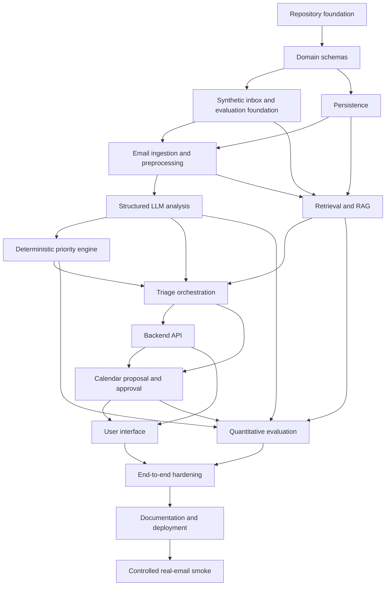

# V1 Implementation Roadmap

This roadmap converts the corrected V1 specification and accepted ADRs into bounded implementation tasks. It does not implement code, scaffold files, change specifications, or add product features.

Authoritative sources:

- `docs/spec/01_scope.md` through `docs/spec/09_mvp_definition.md`
- `docs/planning/10_spec_consistency_review.md`
- `docs/planning/11_technology_decisions.md`
- `docs/decisions/ADR-001` through `ADR-015`

## 1. Implementation Strategy

Build order: establish the repository/tooling foundation first, then domain schemas, evaluation fixtures, persistence, ingestion/preprocessing, fake-provider analysis, deterministic priority, retrieval, orchestration, API, calendar approval, UI, full evaluation, hardening, and delivery docs. Interfaces and fakes come before real adapters.

Runtime processing order: ingestion, validation, preprocessing, persistence, optional indexing, optional retrieval, preference loading, structured LLM analysis, deterministic priority calculation, explanation construction, result persistence, UI/API presentation, optional calendar proposal, approval, optional calendar execution.

Evaluation order: create labelled synthetic fixtures before prompt or weight tuning; validate dataset shape; run deterministic component tests; run fake-provider end-to-end checks; run scenario-based evaluation for LLM-only, LLM+RAG, and RAG+preferences+deterministic scoring; then run real-provider evaluation only when credentials are configured.

The system should remain runnable at each vertical slice. Avoid a large final integration phase by connecting thin paths as soon as their dependencies are stable.

## 2. Milestones

| Milestone | Objective | Requirements covered | Dependencies | Tasks | Tests required | Demonstration checkpoint | Completion criteria | Explicitly excluded |
|---|---|---|---|---|---|---|---|---|
| M01 Repository foundation | Create local project structure, tooling, settings, logging, CI, and health skeleton. | NFR-04, NFR-05, NFR-07, NFR-09, NFR-10, NFR-11, NFR-12 | None | M01-T01 to M01-T07 | Tooling, settings, logging, health tests | Health check runs locally with fake config | `uv`, lint, type, tests, and CI config are defined | Domain behavior, DB schema, UI |
| M02 Domain schemas | Define Pydantic schemas and serialization boundaries. | FR-01 to FR-18 schema coverage, NFR-02, NFR-06 | M01 | M02-T01 to M02-T06 | Schema validation and serialization tests | Domain records serialize/deserialize deterministically | All conceptual entities are representable | ORM tables, API routes |
| M03 Synthetic inbox and evaluation foundation | Create labelled fixture format before tuning. | FR-09, FR-18, NFR-05, NFR-09, NFR-13, NFR-15 | M01, M02 | M03-T01 to M03-T05 | Dataset validation and eval smoke tests | Fixture inbox validates, including multilingual and context cases | Development/test split and leakage rules exist | Prompt tuning, real provider calls |
| M04 Persistence | Add SQLite, SQLAlchemy, Alembic, repositories, transactions, and constraints. | FR-13, FR-16, FR-17, NFR-02, NFR-05 | M02 | M04-T01 to M04-T06 | DB migration and repository integration tests | Records persist across restart in test DB | All core records can be stored and queried | Vector search, API |
| M05 Email ingestion and preprocessing | Load local fixture emails and normalize content with failure isolation. | FR-01, FR-02, FR-18, NFR-01, NFR-13, NFR-14 | M03, M04 | M05-T01 to M05-T06 | Ingestion/preprocessing tests | Synthetic inbox imports to DB | Duplicates, HTML, quotes, signatures, language metadata handled | Live Gmail |
| M06 Structured LLM analysis | Build provider port, fake provider, prompts, schemas, retries, and real adapter. | FR-03 to FR-08, FR-12, FR-18, NFR-06, NFR-09 | M02, M03, M05 | M06-T01 to M06-T07 | LLM contract tests | Fake provider produces valid analysis signals | Structured analysis path is provider-independent | Priority scoring, RAG tuning |
| M07 Deterministic priority engine | Implement auditable deterministic scoring and explanation factors. | FR-10, FR-11, FR-12, NFR-02 | M02, M03, M06 | M07-T01 to M07-T05 | Priority unit and reproducibility tests | Same inputs produce same priority and factors | Engine never calls LLM and preferences affect ranking | Retrieval implementation |
| M08 Retrieval and RAG | Add embedding port, Chroma, indexing, retrieval, context tracking, and recall eval. | FR-09, FR-18, NFR-02, NFR-09, NFR-13 | M03, M04, M05 | M08-T01 to M08-T07 | Retrieval integration and Recall@k tests | Context-dependent fixture retrieves expected source | RetrievedContext is auditable and current email excluded | Agent framework |
| M09 Triage orchestration | Connect single-email and batch pipeline with conditional retrieval and partial failures. | FR-01 to FR-18, NFR-01, NFR-02, NFR-10 | M04 to M08 | M09-T01 to M09-T05 | Orchestration integration tests | Slice A and Slice B pass through services | Batch handles per-email failures and persists status | UI polish |
| M10 Backend API | Expose health, import, analysis, inbox, detail, preferences, proposals, and approval routes. | FR-14, FR-16, NFR-03, NFR-10 | M09 | M10-T01 to M10-T06 | API integration and OpenAPI tests | API returns prioritized inbox from fixtures | API contracts stable for UI | Frontend implementation |
| M11 Calendar proposal and approval | Implement proposal creation, approval states, fake calendar adapter, and optional real adapter. | FR-15, FR-16, FR-17, NFR-03, NFR-04, NFR-14 | M06, M09, M10 | M11-T01 to M11-T06 | Approval safety and idempotency tests | Slice C passes with fake calendar | Unapproved writes impossible; execution optional | Calendar availability lookup |
| M12 User interface | Build limited React UI against stable API. | FR-14, FR-16, US-01 to US-11 | M10, M11 | M12-T01 to M12-T06 | UI/API and minimal component tests | User can inspect inbox and approve/reject proposals | Required fields and states are visible | Full localization, email client replacement |
| M13 Quantitative evaluation | Build scenario pass/fail evaluation and comparison reports. | NFR-09, NFR-13, NFR-15, MVP DoD | M03, M06, M07, M08, M09, M11 | M13-T01 to M13-T06 | Evaluation tests and smoke/full runs | LLM-only, LLM+RAG, full system report generated | Required capabilities have scenarios and reported metrics | Hosted experiment tracking |
| M14 End-to-end hardening | Add full E2E, failure injection, privacy checks, observability verification, and container build. | NFR-01 to NFR-15, MVP DoD | M10 to M13 | M14-T01 to M14-T06 | Full test/eval/container gates | Slice D works with real or documented demo adapters | Clean environment can run locally | Production auth, continuous monitoring |
| M15 Documentation and deployment | Finish README, architecture docs, limits, scripted demo, and optional deployment notes. | NFR-05, NFR-12, MVP DoD | M14 | M15-T01 to M15-T04 | Clean setup and docs verification | Another developer can run the demo | Project is portfolio-ready | Managed SaaS deployment |
| M16 Controlled real-email smoke | Test real email content through a real LLM without live mailbox automation or real calendar writes. | FR-01 to FR-08, FR-12, FR-18, NFR-01, NFR-04, NFR-06, NFR-10, NFR-12 | M15 | M16-T01 to M16-T05 | Backend gate plus manual smoke checklist with sanitized `.eml` files | A small sanitized inbox imports, processes with OpenAI, and remains approval-gated with fake calendar | Real LLM smoke flow is documented, bounded, and reversible | Gmail sync, broad inbox access, real calendar writes |

## 3. Task Decomposition

Command sets referenced below:

- Base gate: `uv run ruff format --check .`; `uv run ruff check .`; `uv run pyright`; `uv run pytest`
- Backend gate: base gate plus `uv run pytest tests/api tests/integration`
- Evaluation gate: base gate plus `uv run python -m email_agent.evaluation.run --config proposed/config/eval.dev.json`
- Frontend gate: `npm run format:check`; `npm run lint`; `npm run typecheck`; `npm test`
- Full gate: base gate, frontend gate, evaluation gate, `docker compose build`

Paths are proposed unless already established by ADRs.

| Task ID | Title | Purpose | Spec refs | ADR refs | Dependencies | Expected files/modules affected | Implementation requirements | Tests to add | Commands that should pass | Acceptance criteria | Non-goals | Suggested commit message |
|---|---|---|---|---|---|---|---|---|---|---|---|---|
| M01-T01 | Create Python project foundation | Establish package, dependency, and source/test layout. | NFR-05, NFR-12 | ADR-001 | None | `pyproject.toml`, `src/email_agent/`, `tests/` | Configure Python 3.12, uv metadata, pytest, package import. | Import smoke test. | Base gate | Empty app imports under pytest. | Business logic. | `Initialize Python project foundation` |
| M01-T02 | Configure linting formatting typing | Add Ruff and Pyright config. | NFR-07, NFR-09 | ADR-001 | M01-T01 | `pyproject.toml`, proposed `pyrightconfig.json` | Enforce formatting, linting, type checking. | Tooling smoke test if useful. | Base gate | Tools run cleanly on skeleton. | Style bikeshedding. | `Configure Python quality tools` |
| M01-T03 | Add typed settings foundation | Provide validated environment settings and `.env.example`. | FR-10, FR-18, NFR-04, NFR-11 | ADR-011 | M01-T01 | proposed `src/email_agent/config.py`, `.env.example`, `.gitignore` | Define settings for DB path, vector path, provider mode, model names, output language, locale/timezone, feature flags. | Settings default/override tests. | Base gate | Missing required demo secrets fail clearly; tests use fake defaults. | Real credentials. | `Add typed runtime settings` |
| M01-T04 | Add structured logging foundation | Create JSON-compatible logging setup and processing ID support. | NFR-10, NFR-02 | ADR-012 | M01-T01 | proposed `src/email_agent/logging.py` | Include event, level, processing_id, email_id, stage, latency fields. | Logging format test. | Base gate | Logs can be parsed as structured records. | Hosted observability. | `Add structured logging foundation` |
| M01-T05 | Add FastAPI health skeleton | Establish minimal backend app and health endpoint. | FR-14, NFR-12 | ADR-002, ADR-015 | M01-T01, M01-T03 | proposed `src/email_agent/api/` | FastAPI app factory, dependency wiring placeholder, health route. | Health endpoint test. | Backend gate | `/health` returns stable OK response. | Domain endpoints. | `Add FastAPI health endpoint` |
| M01-T06 | Add CI workflow | Run quality gates in CI. | NFR-05, NFR-09 | ADR-001, ADR-015 | M01-T01 to M01-T05 | proposed `.github/workflows/ci.yml` | Install uv, run format, lint, type, tests. | CI config validation where possible. | Base gate | CI commands mirror local docs. | Deployment pipeline. | `Add CI quality workflow` |
| M01-T07 | Add local developer command docs | Document initial local commands. | NFR-05, NFR-12 | ADR-015 | M01-T01 to M01-T06 | proposed `README.md` section or `docs/development.md` | Include install/test/health commands and fake-provider defaults. | Docs command smoke if scripted. | Base gate | New developer can run skeleton locally. | Full user docs. | `Document initial local workflow` |
| M02-T01 | Define source email schemas | Represent Email and EmailThread facts. | FR-01, NFR-02 | ADR-003 | M01 | proposed `src/email_agent/domain/` | Pydantic models preserve raw facts and thread relationships. | Validation and serialization tests. | Base gate | Required fields validate; raw facts are not overwritten. | ORM models. | `Add source email domain schemas` |
| M02-T02 | Define processed email schemas | Represent normalized content and language metadata. | FR-02, FR-18, NFR-13 | ADR-003 | M02-T01 | proposed domain schemas | Include detected_language, confidence, locale_hint, processing status/errors. | Validation tests. | Base gate | Malformed states serialize predictably. | Normalization implementation. | `Add processed email schemas` |
| M02-T03 | Define analysis and context schemas | Represent RetrievedContext and EmailAnalysisSignals. | FR-03 to FR-09, FR-18 | ADR-003 | M02-T02 | proposed domain schemas | Include low-value subtype, action/deadline/meeting candidates, prompt/model metadata, source IDs. | Schema and invalid-output tests. | Base gate | LLM outputs can be validated before use. | Provider calls. | `Add analysis and retrieval schemas` |
| M02-T04 | Define priority and preference schemas | Represent UserPreference, PriorityResult, factors, urgency. | FR-10 to FR-12, NFR-02 | ADR-003 | M02-T03 | proposed domain schemas | Include factor references to signals, context IDs, preferences, ruleset version. | Serialization and reconstruction tests. | Base gate | Priority result is reconstructable from stored fields. | Scoring algorithm. | `Add priority and preference schemas` |
| M02-T05 | Define action approval schemas | Represent ProposedAction, CalendarEventProposal, ToolApproval. | FR-15 to FR-17, NFR-03 | ADR-003, ADR-009 | M02-T04 | proposed domain schemas | Include lifecycle states, idempotency key/proposal ID, execution status. | State validation tests. | Base gate | Rejected/expired/executed states cannot validate as executable. | Calendar adapter. | `Add action and approval schemas` |
| M02-T06 | Add schema serialization suite | Prove all domain records round-trip. | FR-13, NFR-06 | ADR-003, ADR-013 | M02-T01 to M02-T05 | `tests/domain/` | Cover JSON round-trip and invalid enum cases. | Serialization tests. | Base gate | All conceptual entities have tests. | Persistence. | `Test domain schema serialization` |
| M03-T01 | Define synthetic inbox format | Establish fixture email and annotation format. | FR-01, FR-18, NFR-05 | ADR-014 | M02 | proposed `datasets/fixtures/`, `docs/evaluation/` | JSONL fixture schema references domain fields and labels. | Dataset schema tests. | Base gate | Fixture format validates. | Large dataset. | `Define synthetic inbox dataset format` |
| M03-T02 | Create initial fixture inbox | Add representative synthetic email set. | US-01 to US-11, NFR-13 | ADR-014 | M03-T01 | proposed `datasets/fixtures/dev.jsonl` | Include low-value, action, deadline, meeting, malformed, multilingual examples. | Fixture validation test. | Base gate | At least two non-English fixture emails validate. | Real email content. | `Add initial synthetic inbox fixtures` |
| M03-T03 | Add thread and context fixtures | Create related-message examples for RAG. | FR-09, NFR-02 | ADR-005, ADR-014 | M03-T02 | fixture files | Include expected related source email IDs and no-leakage labels. | Context fixture tests. | Base gate | At least one context-dependent case is labelled. | Retrieval implementation. | `Add context-dependent evaluation fixtures` |
| M03-T04 | Add evaluation dataset validator | Validate fixture and annotation integrity. | NFR-09, NFR-15 | ADR-014 | M03-T01 to M03-T03 | proposed `src/email_agent/evaluation/` | Check required labels, split membership, no source/target leakage. | Validator tests. | Base gate | Invalid fixtures fail clearly. | Metrics. | `Add evaluation dataset validator` |
| M03-T05 | Add baseline evaluation command | Provide smoke command with empty/fake predictions. | NFR-15, MVP DoD | ADR-014 | M03-T04 | evaluation module | Emit scenario pass/fail skeleton and report file. | Eval smoke test. | Evaluation gate | Evaluation command runs locally without providers. | Prompt tuning. | `Add baseline evaluation command` |
| M04-T01 | Configure database and migrations | Add SQLite engine/session and Alembic setup. | FR-13, NFR-05 | ADR-004 | M01, M02 | proposed `src/email_agent/persistence/`, `alembic/` | Settings-driven DB URL, migration entry point. | DB connection test. | Base gate | Test DB creates cleanly. | Repository behavior. | `Configure SQLite persistence foundation` |
| M04-T02 | Add persistence models | Map conceptual entities to SQLAlchemy models. | FR-13 | ADR-004 | M04-T01, M02 | persistence models | Separate ORM from Pydantic; preserve IDs and JSON fields. | Migration tests. | Base gate | All core tables migrate. | Business logic. | `Add persistence models and migrations` |
| M04-T03 | Add repository interfaces | Define storage boundaries. | FR-13, NFR-07 | ADR-004 | M04-T02 | proposed repositories/interfaces | Ports for email, analysis, context, preference, proposal, approval. | Interface-focused tests with fake repos. | Base gate | Services can depend on repository ports. | SQL implementation details. | `Define repository boundaries` |
| M04-T04 | Implement repositories | Persist and query records. | FR-13, NFR-02 | ADR-004 | M04-T03 | repository implementations | CRUD, list inbox data, transactions, restart persistence. | Integration tests. | Base gate | Stored analysis reloads after new session. | API endpoints. | `Implement SQLite repositories` |
| M04-T05 | Add duplicate/idempotency constraints | Enforce uniqueness and execution safety. | FR-01, FR-17, NFR-03 | ADR-004, ADR-009 | M04-T04 | migrations/models/repos | Unique provider IDs, proposal execution idempotency, approval transitions. | Constraint tests. | Base gate | Duplicate email/proposal execution cannot corrupt state. | Calendar provider. | `Add persistence idempotency constraints` |
| M04-T06 | Add transaction boundary tests | Prove partial writes roll back safely. | NFR-01, NFR-02 | ADR-004, ADR-013 | M04-T04 | tests/integration | Simulate failures mid-stage. | Transaction tests. | Base gate | Failed transaction leaves auditable state. | Orchestrator. | `Test persistence transaction boundaries` |
| M05-T01 | Implement local file ingestion | Load synthetic fixture emails. | FR-01, NFR-05 | ADR-008 | M03, M04 | proposed ingestion module | Parse fixture format into Email records. | Ingestion tests. | Base gate | Representative inbox imports without manual editing. | Gmail/live APIs. | `Implement local email ingestion` |
| M05-T02 | Add duplicate detection | Avoid reimporting same email. | FR-01, NFR-01 | ADR-004 | M05-T01 | ingestion/repositories | Use provider_message_id/source uniqueness. | Duplicate import tests. | Base gate | Reimport does not create duplicate email records. | Deletion/archive. | `Add email duplicate detection` |
| M05-T03 | Implement HTML to text normalization | Normalize HTML/plain text bodies. | FR-02 | ADR-008 | M05-T01 | preprocessing module | Preserve raw body; produce normalized body. | HTML conversion tests. | Base gate | HTML fixture produces readable text. | Attachment extraction. | `Normalize email HTML content` |
| M05-T04 | Add whitespace quote signature handling | Reduce noisy body content. | FR-02 | ADR-008 | M05-T03 | preprocessing module | Whitespace normalization, quoted reply marking/removal, signature handling. | Preprocessing tests. | Base gate | Long reply fixture preserves useful body. | Perfect email parsing. | `Add email body cleanup` |
| M05-T05 | Add language and locale detection | Store source language metadata. | FR-18, NFR-13, NFR-14 | ADR-011 | M05-T03 | preprocessing module | Lightweight detection plus uncertain state; use locale defaults. | Multilingual preprocessing tests. | Base gate | Non-English fixtures get language metadata or uncertainty. | Full translation. | `Add language metadata preprocessing` |
| M05-T06 | Add per-email failure isolation | Keep batch ingestion/preprocessing resilient. | NFR-01, FR-02 | ADR-008 | M05-T01 to M05-T05 | ingestion/preprocessing services | Persist per-email error status and continue. | Malformed batch tests. | Base gate | One malformed email does not stop batch. | Orchestration beyond preprocessing. | `Isolate ingestion preprocessing failures` |
| M06-T01 | Define LLM provider interface | Create provider-independent structured call contract. | FR-03 to FR-08, FR-18 | ADR-006 | M02 | proposed `src/email_agent/ai/` | Include timeout, retry, prompt version, model metadata. | Interface tests. | Base gate | Services use port, not provider SDK. | Real provider. | `Define LLM provider interface` |
| M06-T02 | Implement deterministic fake LLM | Enable tests without remote calls. | NFR-09, NFR-15 | ADR-006, ADR-013 | M06-T01, M03 | fake provider module | Fixture-driven outputs and error modes. | Fake provider tests. | Base gate | Fake returns valid/invalid configured responses. | Prompt tuning. | `Add deterministic fake LLM provider` |
| M06-T03 | Add prompt templates and versioning | Track prompts for analysis. | FR-04 to FR-08, FR-12, FR-18 | ADR-006, ADR-014 | M06-T01 | proposed prompts directory | Versioned templates for summary/category/action/deadline/meeting/language-aware output. | Prompt metadata tests. | Base gate | Prompt version is stored in signals. | Optimizing prompts. | `Add versioned LLM prompts` |
| M06-T04 | Implement structured analysis service | Produce validated EmailAnalysisSignals. | FR-03 to FR-08, FR-18 | ADR-003, ADR-006 | M06-T01 to M06-T03 | analysis service | Validate schema; capture uncertainty and model metadata. | Contract tests. | Base gate | Valid fake output persists as analysis signals. | Priority scoring. | `Implement structured email analysis service` |
| M06-T05 | Add malformed timeout retry handling | Robust model-call behavior. | NFR-06, NFR-10 | ADR-006, ADR-012 | M06-T04 | analysis service | Bounded retries, timeout errors, invalid output error states. | Error-path tests. | Base gate | Invalid model output never reaches downstream as trusted data. | Infinite retry logic. | `Handle LLM failures and retries` |
| M06-T06 | Add real LLM adapter | Support configured provider. | FR-04 to FR-08, FR-18 | ADR-006, ADR-011 | M06-T05 | provider adapter | Use settings, structured output, no domain coupling. | Adapter smoke test behind opt-in marker. | Base gate | Tests do not require live credentials. | Provider-specific business logic. | `Add real LLM provider adapter` |
| M06-T07 | Add LLM contract evaluation smoke | Verify fake/real modes fit eval runner. | NFR-09, NFR-15 | ADR-014 | M06-T04, M03-T05 | evaluation + analysis | Run analysis over fixture subset. | Eval smoke tests. | Evaluation gate | Analysis predictions written with prompt/model metadata. | Weight tuning. | `Add LLM analysis evaluation smoke` |
| M07-T01 | Define priority factor model | Codify scoring inputs. | FR-11, FR-12, NFR-02 | ADR-003 | M02-T04 | domain/priority module | Factor IDs reference signals, context, preferences. | Model tests. | Base gate | Factors serialize and reconstruct decision inputs. | Scoring weights. | `Define priority factor model` |
| M07-T02 | Implement configurable weights | Load deterministic scoring configuration. | FR-10, FR-11, NFR-11 | ADR-011 | M07-T01 | settings/priority | Default weights and thresholds from typed settings. | Config tests. | Base gate | Invalid weights fail clearly. | Learning weights. | `Add priority weight configuration` |
| M07-T03 | Implement scoring function | Calculate score and priority band. | FR-11 | ADR-008 | M07-T02, M06-T04 | priority engine | Combine low-value, action, urgency, sender/category preferences, context influence. | Table-driven boundary tests. | Base gate | Expected fixture scenarios score correctly. | LLM calls. | `Implement deterministic priority scoring` |
| M07-T04 | Implement explanation assembly | Build grounded explanation from stored factors. | FR-12, NFR-02 | ADR-006, ADR-008 | M07-T03 | priority/explanation service | No invented reasons; optional LLM wording only through port later. | Explanation tests. | Base gate | High-priority explanations cite contributing factors. | Free-form ungrounded text. | `Generate grounded priority explanations` |
| M07-T05 | Prove priority reproducibility | Guard deterministic behavior. | NFR-02, NFR-09 | ADR-013 | M07-T03 | tests/priority | Repeat runs, no LLM provider dependency, same inputs same outputs. | Reproducibility tests. | Base gate | Priority engine tests fail if LLM port is called. | RAG implementation. | `Test priority engine reproducibility` |
| M08-T01 | Define embedding provider interface | Abstract vector generation. | FR-09, FR-18 | ADR-007 | M02, M03 | proposed embeddings module | Include model/version/dimension metadata. | Interface tests. | Base gate | Dimension mismatch can be detected. | Chroma integration. | `Define embedding provider interface` |
| M08-T02 | Implement deterministic fake embeddings | Enable retrieval tests offline. | NFR-09 | ADR-007, ADR-013 | M08-T01 | fake embedding adapter | Stable vectors for fixture texts. | Fake embedding tests. | Base gate | Same input returns same vector. | Semantic quality. | `Add deterministic fake embeddings` |
| M08-T03 | Implement Chroma index adapter | Store/search local vector documents. | FR-09 | ADR-005 | M08-T02, M04 | vector store adapter | Persistent collections, metadata filtering, isolated test dirs. | Chroma integration tests. | Base gate | Indexed fixture can be retrieved by ID. | Managed vector DB. | `Add Chroma vector index adapter` |
| M08-T04 | Implement indexing service | Index processed emails for future retrieval. | FR-09 | ADR-005, ADR-008 | M08-T03, M05 | indexing service | Store vector doc IDs and embedding model metadata. | Indexing tests. | Base gate | Processed email is indexable and auditable. | Current-email retrieval. | `Implement processed email indexing` |
| M08-T05 | Implement retrieval service | Retrieve thread/semantic/sender context. | FR-09, FR-18 | ADR-005 | M08-T04 | retrieval service | Conditional retrieval, metadata filters, exclude current email ID, persist scores. | Retrieval service tests. | Base gate | Context fixture retrieves expected source ID. | Final priority decisions. | `Implement retrieved context service` |
| M08-T06 | Add retrieval skip logic | Avoid unnecessary RAG calls. | FR-09, NFR-10 | ADR-008 | M08-T05 | retrieval/orchestration helper | Skip low-value/standalone/no-history cases and record reason. | Skip-condition tests. | Base gate | Skip reason persists for skipped cases. | Mandatory RAG for every email. | `Add retrieval skip conditions` |
| M08-T07 | Add Recall@k evaluation | Measure retrieval scenario success. | NFR-09, NFR-15 | ADR-014 | M08-T05, M03-T03 | evaluation retrieval module | Compare retrieved IDs against labelled expected IDs. | Recall eval tests. | Evaluation gate | Retrieval report includes Recall@k or hit-rate scenario result. | Prompt tuning. | `Add retrieval evaluation metric` |
| M09-T01 | Implement single-email use case | Connect core pipeline for one email. | FR-01 to FR-13, FR-18 | ADR-008 | M04-M08 | orchestration service | Ingest/preprocess/analyze/score/explain/persist with fakes. | Single-email integration test. | Base gate | Slice A passes through DB and fake analysis. | Batch processing. | `Implement single email triage use case` |
| M09-T02 | Implement batch processing | Run per-email workflow over inbox. | NFR-01, FR-01 | ADR-008 | M09-T01 | orchestration service | Continue after per-email failure; stage statuses. | Batch failure tests. | Base gate | Malformed fixture does not stop batch. | Continuous monitoring. | `Add batch triage processing` |
| M09-T03 | Connect conditional retrieval | Include RAG only when useful. | FR-09, FR-12 | ADR-005, ADR-008 | M08, M09-T01 | orchestration service | Retrieve before analysis when triggered; pass context to LLM. | Context-aware integration tests. | Base gate | Slice B context affects analysis/explanation. | Always-on RAG. | `Connect conditional retrieval to triage` |
| M09-T04 | Connect proposal creation | Generate proposals during pipeline. | FR-15, NFR-14 | ADR-008, ADR-009 | M06, M09-T01 | orchestration/calendar proposal | Create complete/incomplete proposals from extracted candidates. | Proposal integration tests. | Base gate | Meeting fixture produces proposal. | Calendar execution. | `Connect calendar proposal creation` |
| M09-T05 | Add orchestration idempotency | Make reruns safe. | FR-13, FR-17, NFR-02 | ADR-004, ADR-008 | M09-T02 to M09-T04 | orchestration/repos | Reprocessing updates or reuses records predictably. | Rerun tests. | Base gate | Re-running fixture inbox does not duplicate emails/proposals. | Live providers. | `Make triage orchestration idempotent` |
| M10-T01 | Define API error and response contracts | Stabilize API shapes for UI. | FR-14, NFR-10 | ADR-002, ADR-003 | M09 | API schemas | Error format, pagination/list responses, detail response. | API schema tests. | Backend gate | OpenAPI includes stable response models. | UI implementation. | `Define API response contracts` |
| M10-T02 | Add import and processing endpoints | Trigger fixture import and analysis. | FR-01, FR-14 | ADR-002 | M10-T01, M09 | API routes | Endpoints for import, single analysis, inbox analysis. | API integration tests. | Backend gate | API can process fixture inbox with fakes. | Live Gmail. | `Add import and processing API endpoints` |
| M10-T03 | Add inbox list and detail endpoints | Serve prioritized inbox data. | FR-14, US-01 to US-06 | ADR-002 | M10-T02 | API routes | List by priority, detail includes factors/context/proposal state. | API tests. | Backend gate | API returns required UI fields. | UI rendering. | `Add inbox and email detail APIs` |
| M10-T04 | Add preference endpoints | Configure user preferences. | FR-10, US-07, FR-18 | ADR-002, ADR-011 | M10-T01, M04 | API/routes/preferences | CRUD or update endpoints for V1 preference set. | API tests. | Backend gate | Preference update can affect recalculation path. | Full auth. | `Add user preference API endpoints` |
| M10-T05 | Add proposal and approval endpoints | Expose pending proposals and decisions. | FR-15, FR-16 | ADR-002, ADR-009 | M10-T03, M11-T02 if done later | API routes | Pending proposals, approve, reject, status; backend enforces transitions. | API approval tests. | Backend gate | UI cannot bypass approval service. | Real calendar calls. | `Add calendar proposal approval APIs` |
| M10-T06 | Validate OpenAPI and API tests | Keep API contract testable. | NFR-09, NFR-10 | ADR-002, ADR-013 | M10-T01 to M10-T05 | tests/api | Schema generation and error-path tests. | OpenAPI tests. | Backend gate | API docs generated without schema errors. | Frontend generation. | `Test API contract coverage` |
| M11-T01 | Implement calendar proposal service | Validate event proposals. | FR-15, NFR-14 | ADR-009 | M09-T04 | calendar proposal module | Required fields, missing fields, locale ambiguity, duplicate candidate handling. | Proposal service tests. | Base gate | Complete/incomplete proposal statuses correct. | Approval decisions. | `Implement calendar proposal service` |
| M11-T02 | Implement approval state machine | Enforce decision transitions. | FR-16, NFR-03 | ADR-009 | M02-T05, M04 | approval service | pending/incomplete/approved/rejected/expired/executing/executed/failed rules. | State transition tests. | Base gate | Rejected/expired/executed cannot execute. | Calendar adapter. | `Implement approval state transitions` |
| M11-T03 | Define calendar port and fake adapter | Test writes without provider. | FR-17, NFR-03 | ADR-009, ADR-013 | M11-T02 | calendar port/adapters | Fake tracks calls, supports errors, idempotency by proposal ID. | Fake adapter tests. | Base gate | Unauthorized write count stays zero. | Google integration. | `Add calendar port and fake adapter` |
| M11-T04 | Add backend execution service | Gate execution in backend logic. | FR-16, FR-17 | ADR-002, ADR-009 | M11-T03, M10 | backend/application service | Check approval before adapter call; persist execution result. | Approval bypass tests. | Backend gate | No path executes unapproved proposal. | UI. | `Enforce backend calendar execution approval` |
| M11-T05 | Add optional Google adapter | Support real demo execution if enabled. | FR-17 Should, NFR-04 | ADR-009, ADR-011 | M11-T04 | optional calendar adapter | Settings-driven credentials, no default live tests, no secrets. | Opt-in smoke test or mocked SDK tests. | Backend gate | Automated tests pass without credentials. | Making execution Must. | `Add optional Google Calendar adapter` |
| M11-T06 | Add execution idempotency tests | Prevent duplicate external actions. | FR-17, NFR-03 | ADR-009, ADR-013 | M11-T04 | tests/calendar | Retry approved execution and assert one adapter write. | Idempotency tests. | Backend gate | Duplicate retries do not create duplicate events. | Provider rate-limit handling beyond V1. | `Test calendar execution idempotency` |
| M12-T01 | Create frontend foundation | Add Vite React TypeScript app. | FR-14, NFR-12 | ADR-010, ADR-015 | M10-T01 | proposed `frontend/` | Vite, TS, basic API client setup. | Frontend smoke test. | Frontend gate | Frontend builds/tests against mocked API. | Backend changes. | `Initialize React frontend` |
| M12-T02 | Build prioritized inbox view | Show reduced prioritized inbox. | US-01, FR-14 | ADR-010 | M12-T01, M10-T03 | frontend components | Priority, summary, category, action/deadline indicators, low-value separation. | Component tests. | Frontend gate | Fixture API data renders required fields. | Email client features. | `Build prioritized inbox view` |
| M12-T03 | Build email detail view | Show explanations and context. | US-02 to US-08, FR-12, FR-14 | ADR-010 | M12-T02 | frontend components | Summary, category rationale, factors, context, language/output info when present. | Component tests. | Frontend gate | User can inspect why high priority was assigned. | Editing analysis. | `Build email detail analysis view` |
| M12-T04 | Build preference configuration view | Allow V1 preference changes. | US-07, FR-10, FR-18 | ADR-010, ADR-011 | M12-T01, M10-T04 | frontend components | Important senders/categories/keywords, output language, locale/timezone. | UI/API tests. | Frontend gate | Saving preferences calls API and updates state. | Complex auth/user profiles. | `Build preference configuration UI` |
| M12-T05 | Build proposal approval UI | Approve/reject pending proposals. | US-09, US-10, FR-15, FR-16 | ADR-010 | M12-T03, M10-T05 | frontend components | Pending proposal list/detail, approve/reject actions, status/error states. | UI/API tests. | Frontend gate | Rejected proposal does not execute; approved calls API path. | Direct provider calls. | `Build calendar proposal approval UI` |
| M12-T06 | Add UI loading and error states | Make UI usable across failures. | NFR-10, US-01 | ADR-010 | M12-T02 to M12-T05 | frontend components | Empty, loading, API error, partial analysis states. | Component tests. | Frontend gate | Failed email state is visible without hiding successes. | Visual redesign beyond V1. | `Add UI loading and error states` |
| M13-T01 | Implement prediction runner | Run system variants over fixtures. | NFR-15, MVP DoD | ADR-014 | M09, M03 | evaluation runner | Modes: LLM-only, LLM+RAG, full system. | Runner tests. | Evaluation gate | Predictions written with run metadata. | Hosted tracking. | `Implement evaluation prediction runner` |
| M13-T02 | Add classification metrics | Evaluate category/low-value/action flags. | FR-03, FR-05, FR-06 | ADR-014 | M13-T01 | evaluation metrics | Accuracy/exact match plus scenario pass/fail. | Metrics tests. | Evaluation gate | Report includes classification results. | Strict global thresholds. | `Add classification evaluation metrics` |
| M13-T03 | Add extraction metrics | Evaluate action/deadline/meeting extraction. | FR-07, FR-08, FR-18 | ADR-014 | M13-T01 | evaluation metrics | Field-level exact/partial scenario checks and uncertainty handling. | Metrics tests. | Evaluation gate | Multilingual date case reports pass/fail. | Perfect NLP benchmark. | `Add extraction evaluation metrics` |
| M13-T04 | Add summary faithfulness method | Evaluate summaries pragmatically. | FR-04, FR-18 | ADR-014 | M13-T01 | evaluation metrics | Reference/rubric fields, source-language/output-language checks. | Eval tests. | Evaluation gate | Report identifies faithful/unfaithful summary scenarios. | LLM judge dependency as default. | `Add summary faithfulness checks` |
| M13-T05 | Add retrieval priority preference metrics | Evaluate RAG and ranking effects. | FR-09 to FR-12 | ADR-014 | M08-T07, M07 | evaluation metrics | Recall@k, priority scenario pass/fail, preference adherence. | Metrics tests. | Evaluation gate | Report compares LLM-only, LLM+RAG, full system. | Optimizing weights here. | `Add retrieval and priority evaluation` |
| M13-T06 | Add unauthorized-write evaluation | Verify safety scenario. | FR-16, NFR-03 | ADR-009, ADR-014 | M11 | evaluation safety | Run approval-gating scenario and count writes. | Safety eval tests. | Evaluation gate | Unauthorized writes reported as zero. | Real provider required. | `Add calendar safety evaluation` |
| M14-T01 | Add full end-to-end test | Cover complete fake-provider flow. | MVP DoD | ADR-013, ADR-015 | M10-M13 | tests/e2e | Import/process/display API/proposal/approval with fakes. | E2E test. | Full gate except optional Docker if not yet added | Full fake flow passes. | Browser automation unless chosen later. | `Add full fake end-to-end test` |
| M14-T02 | Add failure injection tests | Exercise malformed emails/provider failures. | NFR-01, NFR-06, NFR-10 | ADR-013 | M09, M11 | tests/integration | LLM malformed output, retrieval failure, calendar failure, DB rollback. | Failure tests. | Base gate | Failures persist status and batch continues. | Chaos infrastructure. | `Add failure injection tests` |
| M14-T03 | Add privacy and secret checks | Guard repo contents. | NFR-04 | ADR-011 | M01-M13 | proposed scripts/docs/CI | Check `.env`, fixture policy, no obvious keys, no real email markers. | Secret/privacy check test. | Base gate | CI can fail on committed secret patterns. | Enterprise DLP. | `Add privacy and secret checks` |
| M14-T04 | Verify structured observability | Ensure logs/status support audit. | NFR-02, NFR-10 | ADR-012 | M09-M13 | tests/logging/integration | Assert stage status, IDs, model metadata, retrieval scores, errors. | Log/status tests. | Base gate | Processing run emits auditable metadata. | Hosted tracing. | `Verify structured processing observability` |
| M14-T05 | Add local startup command | Run backend/frontend locally. | NFR-12 | ADR-015 | M10, M12 | proposed scripts or docs | Provide local commands for API and frontend using fake providers. | Startup smoke test if scriptable. | Backend gate; Frontend gate | Clean local startup path documented and works. | Deployment. | `Add local startup workflow` |
| M14-T06 | Add optional container build | Package demo environment. | NFR-05, hardening | ADR-015 | M14-T05 | proposed `Dockerfile`, `docker-compose.yml` | Build local services without secrets; mount local data safely. | Container build test. | `docker compose build` | Container image builds cleanly. | Kubernetes. | `Add optional demo container build` |
| M15-T01 | Write README setup guide | Make project runnable by another developer. | NFR-05, NFR-12, MVP DoD | ADR-015 | M14 | `README.md` | Setup, config, fake providers, tests, eval, UI, known limits. | Clean-environment docs test/manual checklist. | Full gate | Fresh checkout can follow README. | Marketing site. | `Document local setup and usage` |
| M15-T02 | Update architecture documentation | Explain implemented architecture. | NFR-07, NFR-10 | ADR-002 to ADR-012 | M14 | proposed `docs/architecture.md` | Component boundaries, data flow, approval enforcement, adapters. | Link/check docs if available. | Base gate | Architecture docs match implemented modules. | New architecture choices. | `Document implemented architecture` |
| M15-T03 | Produce evaluation report | Capture final scenario results. | NFR-15, MVP DoD | ADR-014 | M13, M14 | proposed `docs/evaluation_report.md` | Include dataset, variants, pass/fail, metrics, limitations. | Evaluation command. | Evaluation gate | Report includes all required capabilities. | Inflated benchmark claims. | `Add V1 evaluation report` |
| M15-T04 | Script demonstration flow and deployment notes | Prepare portfolio demo. | MVP DoD, NFR-12 | ADR-015 | M15-T01 to M15-T03 | README/docs/scripts | Scripted demo steps, optional deployment notes, limitations. | Demo smoke checklist. | Full gate | Demo shows inbox, RAG, preferences, multilingual, proposal approval. | Production SaaS deployment. | `Document V1 demo flow` |
| M16-T01 | Wire configured LLM into API processing | Let API processing use fake or OpenAI based on settings. | FR-03 to FR-08, FR-12, FR-18 | ADR-006, ADR-011 | M15 | `src/email_agent/api`, `src/email_agent/ai` | Replace hardcoded fixture analysis service for non-fake mode; keep fixture fake mode default and deterministic. | Provider selection/API tests. | Backend gate | `EMAIL_AGENT_LLM_PROVIDER=openai` requires a key and routes through the OpenAI provider. | Prompt tuning, agent framework. | `Wire configured LLM provider into API` |
| M16-T02 | Add local `.eml` import | Provide a controlled real-email import path without mailbox credentials. | FR-01, FR-02, NFR-01, NFR-04, NFR-12 | ADR-008, ADR-011 | M16-T01 | `src/email_agent/ingestion`, API/docs/scripts | Parse bounded `.eml` files into Email records; preserve raw body locally; reject directories unless explicit. | `.eml` parser and duplicate tests. | Backend gate | A few exported emails import without Gmail/IMAP access. | Live mailbox sync, attachments. | `Add local eml email import` |
| M16-T03 | Add real-email privacy guardrails | Keep real content local and reduce accidental leakage. | NFR-04, NFR-10, NFR-12 | ADR-011, ADR-012, ADR-015 | M16-T02 | `.gitignore`, privacy checks, docs | Ensure imported mail DB/vector paths are ignored; document sanitization; keep real email fixtures out of commits. | Privacy check coverage. | Base gate plus privacy scan | Real email artifacts are ignored and warnings are documented. | Enterprise DLP. | `Guard real email smoke data` |
| M16-T04 | Add real LLM smoke command | Make the manual smoke repeatable. | NFR-05, NFR-06, NFR-10, NFR-12 | ADR-006, ADR-013, ADR-015 | M16-T01 to M16-T03 | `scripts/`, docs | Import 3-5 `.eml` files, process through OpenAI, show inbox/proposals, and keep calendar fake. | Script smoke where possible with fake mode. | Backend gate; manual OpenAI smoke when key is configured | Smoke checklist verifies summaries, actions, deadlines, priorities, and errors. | Automated live-provider CI. | `Add real LLM smoke workflow` |
| M16-T05 | Document access requirements and rollback | State required keys and safe operating limits. | NFR-04, NFR-05, NFR-12 | ADR-011, ADR-015 | M16-T04 | README/docs | Document OpenAI env vars, no calendar write default, local data cleanup, and what not to grant yet. | Docs review. | Full gate where Docker is available | A tester knows exactly what keys to provide and how to remove local real-email data. | Gmail OAuth, real calendar execution. | `Document real email smoke testing` |

## 4. Required Task Coverage

All required categories are covered:

- Repository foundation: M01-T01 through M01-T07.
- Domain layer: M02-T01 through M02-T06.
- Evaluation foundation: M03-T01 through M03-T05.
- Persistence: M04-T01 through M04-T06.
- Ingestion and preprocessing: M05-T01 through M05-T06.
- LLM analysis: M06-T01 through M06-T07.
- Priority engine: M07-T01 through M07-T05.
- Retrieval and RAG: M08-T01 through M08-T07.
- Orchestration: M09-T01 through M09-T05.
- Backend API: M10-T01 through M10-T06.
- Calendar actions: M11-T01 through M11-T06.
- User interface: M12-T01 through M12-T06.
- Evaluation: M13-T01 through M13-T06.
- Hardening and delivery: M14-T01 through M15-T04.
- Controlled real-email smoke: M16-T01 through M16-T05.

Roadmap gaps: none for Must requirements or Definition-of-Done conditions. FR-17 is Should and is included as optional calendar execution tasks M11-T03 through M11-T06. M16 is a post-V1 smoke-testing milestone for real email content and real LLM calls, not a new production requirement.

## 5. Dependency Graph

Safe parallel work:

- After M01, M02 schema work and M03 fixture-format design can proceed together if schema interfaces are stable.
- M04 persistence and M06 LLM port/fake work can proceed in parallel after M02.
- M07 priority engine and M08 retrieval can proceed in parallel after their shared schemas and fixtures exist.
- M11 calendar work can proceed alongside M12 UI after API contracts for proposals and approvals are stable.
- M13 evaluation metrics can be built incrementally in parallel with later integration, but labelled evaluation data must precede prompt or weight optimization.

## 6. Vertical-Slice Checkpoints

| Slice | Required tasks | Acceptance test |
|---|---|---|
| Slice A: Deterministic skeleton | M01-T01 to M01-T05, M02, M03-T01, M04-T01 to M04-T04, M05-T01, M06-T02, M07-T03, M09-T01, M10-T02 | A synthetic email passes through ingestion, preprocessing, fake analysis, priority calculation, persistence, and API response. Run Backend gate. |
| Slice B: Context-aware analysis | Slice A plus M03-T03, M08-T01 to M08-T07, M09-T03, M07-T04 | A context-dependent email retrieves expected source context, receives structured analysis, deterministic ranking, and grounded explanation. Run Evaluation gate. |
| Slice C: Safe external action | Slice A plus M09-T04, M10-T05, M11-T01 to M11-T04, M12-T05 | A meeting email produces a proposal visible through API/UI; approval is required; fake calendar executes only after approval. Run Backend gate and Frontend gate. |
| Slice D: Local demo | M01 through M15, with M06-T06 and M11-T05 enabled only when credentials are configured | Complete test inbox runs with fake or documented demo adapters, retrieval, priority engine, UI, and approval-gated calendar execution. Run Full gate. |
| Slice E: Controlled real-email smoke | M16-T01 through M16-T05 | A small sanitized `.eml` inbox runs through a configured real LLM, persists results locally, and keeps calendar execution fake unless explicitly enabled later. Run Backend gate plus manual smoke checklist. |

## 7. Test Gates

| Milestone | Required commands |
|---|---|
| M01 | `uv run ruff format --check .`; `uv run ruff check .`; `uv run pyright`; `uv run pytest` |
| M02 | Base gate |
| M03 | Base gate; `uv run python -m email_agent.evaluation.run --config proposed/config/eval.dev.json` |
| M04 | Base gate |
| M05 | Base gate |
| M06 | Base gate; evaluation smoke command |
| M07 | Base gate |
| M08 | Base gate; evaluation smoke command |
| M09 | Base gate |
| M10 | Backend gate |
| M11 | Backend gate |
| M12 | Backend gate; Frontend gate |
| M13 | Evaluation gate |
| M14 | Full gate where Docker files exist; otherwise base, backend, frontend, and evaluation gates |
| M15 | Full gate plus clean-environment setup checklist |
| M16 | Backend gate; privacy scan; real LLM smoke checklist only when `EMAIL_AGENT_LLM_API_KEY` is configured |

## 8. Risk Register

| Risk ID | Probability | Impact | Warning sign | Mitigation | Milestone |
|---|---|---|---|---|---|
| R-01 Synthetic data lacks meaningful thread context | Medium | High | Retrieval passes trivial keyword cases only | Add labelled multi-message context fixtures before retrieval implementation | M03 |
| R-02 LLM schema failures are frequent | Medium | High | Many malformed outputs in eval smoke | Use strict Pydantic validation, retries, fake malformed tests, prompt versioning | M06 |
| R-03 Deadline normalization is inaccurate | Medium | High | Locale-specific cases produce wrong dates | Store uncertainty, locale/timezone assumptions, scenario tests | M05, M06, M13 |
| R-04 Retrieval appears useful but does not improve results | Medium | High | Full-system eval does not differ from LLM-only | Compare variants and require at least one labelled context influence case | M08, M13 |
| R-05 Priority weights are chosen without evidence | Medium | Medium | Weight changes lack fixture justification | Use scenario fixtures and reproducibility tests before tuning | M07, M13 |
| R-06 Prompt overfits evaluation set | Medium | Medium | Prompt changes only improve narrow examples | Keep development/test split and record prompt versions | M03, M13 |
| R-07 Frontend consumes excessive time | Medium | Medium | UI tasks block core backend/eval | Keep React screens limited to specified workflows | M12 |
| R-08 Calendar authentication delays core system | High | Medium | OAuth setup blocks approval tests | Use fake adapter first; real Google adapter remains Should | M11 |
| R-09 Approval bypass | Low | High | API route can call adapter without approval check | Centralize backend execution service and safety tests | M11 |
| R-10 Duplicate external actions | Medium | High | Retried execution creates multiple fake events | Idempotency per proposal ID and repository constraints | M04, M11 |
| R-11 Provider cost or rate limits | Medium | Medium | Eval runs call real provider by default | Default to fake providers; real-provider eval opt-in | M06, M13 |
| R-12 Real email privacy leak | Low | High | Fixture contains real names or secrets | Synthetic fixtures only, `.gitignore`, secret/privacy checks | M03, M14 |

## 9. Recommended Commit Sequence

Use small commits aligned with tasks. Do not auto-commit unless explicitly authorized later.

1. `Initialize Python project foundation` for M01-T01.
2. `Configure Python quality tools` for M01-T02.
3. `Add typed runtime settings` for M01-T03.
4. `Add structured logging foundation` for M01-T04.
5. `Add FastAPI health endpoint` for M01-T05.
6. `Add CI quality workflow` for M01-T06.
7. `Document initial local workflow` for M01-T07.
8. One commit per M02 schema task, ending with serialization tests.
9. One commit per M03 fixture/evaluation-foundation task.
10. One commit per M04 persistence task.
11. One commit per M05 ingestion/preprocessing task.
12. One commit per M06 LLM task, with real adapter last.
13. One commit per M07 priority task.
14. One commit per M08 retrieval task.
15. One commit per M09 orchestration task.
16. One commit per M10 API task.
17. One commit per M11 calendar task, with optional Google adapter after fake safety passes.
18. One commit per M12 UI task.
19. One commit per M13 evaluation task.
20. One commit per M14 hardening task.
21. One commit per M15 documentation/delivery task.
22. One commit per M16 controlled real-email smoke task.

Each commit should include relevant tests and leave the current milestone gate passing.

## 10. Prompt-Generation Handoff

Every task in Section 3 includes:

- authoritative source documents through Spec refs and ADR refs
- exact behavior to implement through Purpose and Implementation requirements
- affected interfaces through Expected files/modules affected
- expected tests through Tests to add
- acceptance commands through Commands that should pass
- non-goals
- dependencies
- expected deliverable through Acceptance criteria and Suggested commit message

Later prompt generation should use one task row at a time. For tasks with broad implementation files marked as proposed, the coding agent should inspect the repository first and follow established module names once earlier tasks have created them.

## 11. MVP Critical Path

Shortest dependency path to working MVP:

M01 repository foundation -> M02 domain schemas -> M03 labelled synthetic fixtures -> M04 persistence -> M05 ingestion/preprocessing -> M06 fake structured LLM analysis -> M07 priority engine -> M08 retrieval -> M09 orchestration -> M10 backend API -> M11 proposal/approval with fake calendar -> M12 minimal UI -> M13 scenario evaluation -> M14 full E2E hardening -> M15 README/demo documentation -> M16 controlled real-email smoke.

Tasks that may be deferred without weakening the core demonstration:

- M06-T06 real LLM adapter until fake-provider contract passes, but it must exist before real demonstration.
- M11-T05 optional Google Calendar adapter because calendar execution is Should.
- M14-T06 optional container build if local startup is reliable and deployment is not required.
- M12 UI polish beyond required loading/error states.
- M16 Gmail/IMAP sync and real calendar writes until controlled `.eml` plus real LLM smoke testing is acceptable.

Tasks that must not be deferred:

- M01-T03 settings and secret handling.
- M02 domain schemas.
- M03 labelled evaluation fixtures.
- M04 persistence for auditability.
- M05 per-email failure isolation.
- M06 structured output validation and fake LLM.
- M07 deterministic priority and explanation factors.
- M08 RetrievedContext source tracking.
- M09 pipeline orchestration.
- M10 API contracts.
- M11 approval gating and fake calendar safety tests.
- M13 scenario-based evaluation.
- M14 privacy, failure, and end-to-end checks.
- M15 setup documentation.
- M16 privacy guardrails before any real email content is imported.

Recommended first implementation task: M01-T01 Create Python project foundation.

Implementation may begin when the team accepts this roadmap as the task source for coding-agent prompts. The roadmap covers every Must requirement and every Definition-of-Done condition from `docs/spec/09_mvp_definition.md`. No unmapped Must requirement remains.
