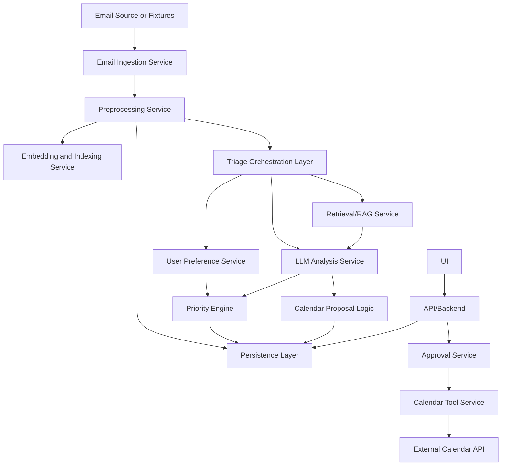

# Component Architecture

V1 uses a single orchestration layer. Components are separated by responsibility, not by framework.

## Component Diagram

## Email Ingestion Service

- Responsibility: Load emails from fixtures, files, or a controlled provider source.
- Inputs: Email source configuration.
- Outputs: Raw email records.
- Dependencies: Email source, persistence.
- Must not: Analyze, prioritize, delete, archive, or send emails.
- Failure modes: Source unavailable, malformed message, missing required fields.
- Independent tests: Fixture import tests and malformed message tests.

## Preprocessing Service

- Responsibility: Normalize email text and metadata for analysis, including initial language detection and locale hints when available.
- Inputs: Raw email records.
- Outputs: Processed email records with normalized content and optional language metadata.
- Dependencies: Ingestion output.
- Must not: Make final semantic decisions or write external tools.
- Failure modes: Encoding errors, missing body, oversized content, uncertain language detection.
- Independent tests: Normalization fixtures, validation errors, and supported-language detection fixtures.

## Embedding And Indexing Service

- Responsibility: Create searchable representations for historical context.
- Inputs: Processed emails.
- Outputs: Indexed documents or embedding records.
- Dependencies: Persistence and embedding provider or local embedding model.
- Must not: Decide priority or generate final explanations.
- Failure modes: Embedding API failure, index unavailable, duplicate documents.
- Independent tests: Index insert/search tests with deterministic fixtures or mocked embeddings.

## Retrieval/RAG Service

- Responsibility: Retrieve relevant historical email context when requested.
- Inputs: Current email, retrieval trigger, thread IDs, search query.
- Outputs: Retrieved context records.
- Dependencies: Indexing service and persistence.
- Must not: Make final priority decisions.
- Failure modes: No matches, irrelevant matches, index timeout.
- Independent tests: Known related-message retrieval fixtures.

## LLM Analysis Service

- Responsibility: Perform semantic interpretation and produce structured analysis.
- Inputs: Processed email, optional retrieved context, output-language preference, locale defaults, schema, prompt version.
- Outputs: Validated analysis signals, including language-aware summaries, explanations, extracted actions, and extracted date or meeting candidates.
- Dependencies: LLM provider and schema validation.
- Must not: Execute external tools or be the sole source of final priority.
- Failure modes: Invalid schema output, refusal, timeout, low confidence, unsupported language, ambiguous locale-specific date expression.
- Independent tests: Schema validation, mocked model output, golden fixture evals, and non-English fixture evals.

## User Preference Service

- Responsibility: Store and retrieve user-specific preferences.
- Inputs: Local config or UI changes.
- Outputs: Active preference set, including output language, locale, and timezone defaults.
- Dependencies: Persistence or configuration files.
- Must not: Analyze email content.
- Failure modes: Invalid preference config, missing defaults.
- Independent tests: Preference load, validation, and weighting tests.

## Calendar Proposal Logic

- Responsibility: Convert extracted meeting or deadline candidates into validated calendar event proposals.
- Inputs: Email analysis signals, source email metadata, locale/timezone defaults, and proposal completeness rules.
- Outputs: Calendar event proposals with status, confidence, missing fields, and source references.
- Dependencies: LLM analysis output, user preferences, persistence.
- Must not: Execute calendar writes or infer user approval.
- Failure modes: Missing required event fields, ambiguous date or timezone, duplicate proposal candidate.
- Independent tests: Proposal generation, incomplete proposal handling, duplicate candidate handling, and locale ambiguity tests.

## Priority Engine

- Responsibility: Calculate final priority deterministically.
- Inputs: Analysis signals, user preferences, retrieved context, deadline data, low-value flags.
- Outputs: Priority score, band, and contributing factors.
- Dependencies: Ruleset configuration.
- Must not: Call LLMs or external APIs.
- Failure modes: Missing signals, invalid factors, threshold errors.
- Independent tests: Table-driven tests for known inputs and expected rankings.

## Persistence Layer

- Responsibility: Store emails, processed records, analysis results, retrieved context, priorities, proposals, approvals, and errors.
- Inputs: Records from all internal services.
- Outputs: Queryable persisted state.
- Dependencies: Local database or structured files.
- Must not: Contain business logic beyond constraints.
- Failure modes: Write failure, migration mismatch, duplicate IDs.
- Independent tests: CRUD, restart persistence, and constraint tests.

## Triage Orchestration Layer

- Responsibility: Coordinate per-email processing from preprocessing through final persistence.
- Inputs: Email IDs or batch processing command.
- Outputs: Completed or failed analysis records.
- Dependencies: Preprocessing, retrieval, LLM analysis, preferences, priority, persistence, calendar proposal logic.
- Must not: Hide component errors or perform external side effects directly.
- Failure modes: Component timeout, partial processing, retry exhaustion.
- Independent tests: End-to-end pipeline with mocked services and per-email failure isolation.

## Calendar Tool Service

- Responsibility: Execute approved calendar writes through an external API.
- Inputs: Approved calendar event proposal.
- Outputs: Calendar write result and provider event ID.
- Dependencies: External calendar API and credentials.
- Must not: Create events without approval.
- Failure modes: Authentication failure, API validation error, network failure.
- Independent tests: Mocked API tests and approval-gating tests.

## Approval Service

- Responsibility: Record user approval or rejection for proposed external actions.
- Inputs: User decision and proposal ID.
- Outputs: Tool approval record.
- Dependencies: Persistence.
- Must not: Infer approval automatically.
- Failure modes: Duplicate approval, stale proposal, invalid transition.
- Independent tests: State transition and authorization tests.

## API/Backend

- Responsibility: Expose processing, inbox, detail, preference, approval, and calendar execution operations to the UI.
- Inputs: UI requests.
- Outputs: JSON responses or equivalent structured responses.
- Dependencies: Orchestration, persistence, approval, calendar service.
- Must not: Put UI rendering logic into business services.
- Failure modes: Validation errors, unavailable service, inconsistent state.
- Independent tests: Request/response tests and error handling tests.

## UI

- Responsibility: Provide a simple interface for reviewing prioritized email analysis and approving calendar proposals.
- Inputs: Backend data.
- Outputs: User actions and visible triage screens.
- Dependencies: API/backend.
- Must not: Calculate authoritative priority or bypass approval service.
- Failure modes: Empty states, loading failures, stale data.
- Independent tests: Component tests and end-to-end UI workflow tests.
