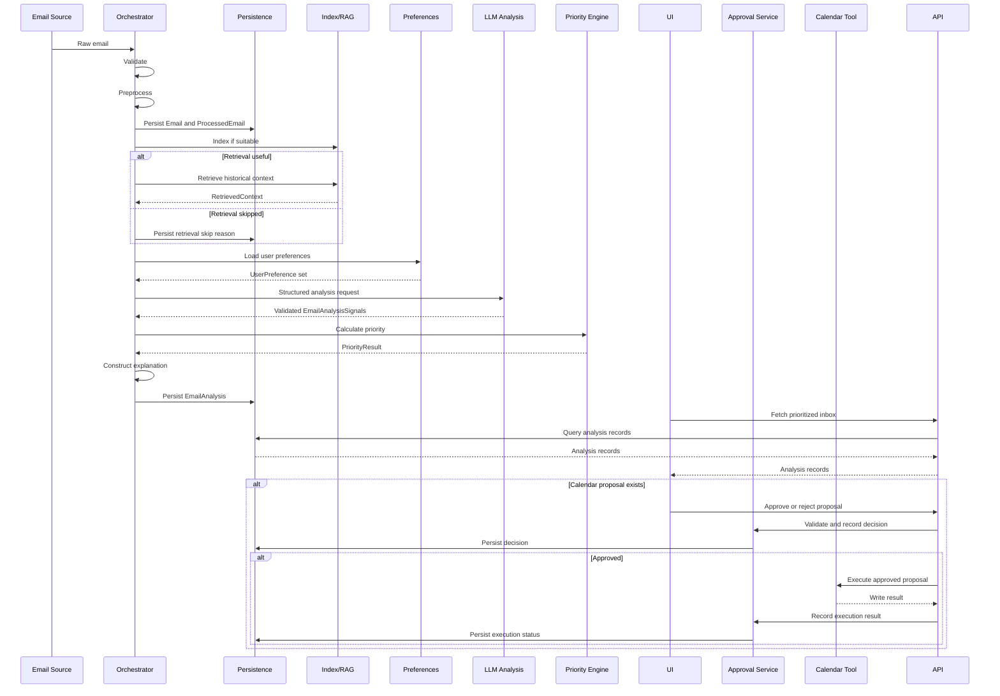

# End-To-End Processing Flow

This workflow describes processing for one incoming email. Batch processing should apply the same flow per email and isolate failures per message.

## Numbered Workflow

1. Email ingestion
   - Input: Raw email source record.
   - Operation: Load source fields and assign internal email ID.
   - Output: `Email`.
   - Failure behavior: Mark email import failed and continue with other emails.
   - Type: Deterministic.
   - Required: Mandatory.

2. Validation
   - Input: `Email`.
   - Operation: Check required fields such as sender, subject, body or body fallback, and received timestamp.
   - Output: Valid email or structured validation error.
   - Failure behavior: Persist error and skip downstream analysis for that email.
   - Type: Deterministic.
   - Required: Mandatory.

3. Preprocessing
   - Input: Valid `Email`.
   - Operation: Normalize text, trim unsupported content, detect language when possible, preserve raw source, and prepare analysis body.
   - Output: `ProcessedEmail`.
   - Failure behavior: Persist preprocessing error and skip model analysis.
   - Type: Deterministic.
   - Required: Mandatory.

4. Initial persistence
   - Input: `Email` and `ProcessedEmail`.
   - Operation: Store raw reference and normalized content.
   - Output: Persisted records.
   - Failure behavior: Stop processing that email and report storage failure.
   - Type: Deterministic.
   - Required: Mandatory.

5. Embedding/index update
   - Input: `ProcessedEmail`.
   - Operation: Add processed content to the retrieval index when it is suitable for future retrieval.
   - Output: Indexed document or skipped index status.
   - Failure behavior: Record indexing failure; continue if current email analysis does not require retrieval.
   - Type: Retrieval-based infrastructure.
   - Required: Conditional.

6. Historical-context retrieval
   - Input: Current `ProcessedEmail`, thread metadata, sender, subject, and retrieval trigger signals.
   - Operation: Retrieve relevant prior thread messages, sender history, or semantically similar emails.
   - Output: `RetrievedContext` records or skip reason.
   - Failure behavior: Record retrieval failure and continue analysis without context.
   - Type: Retrieval-based.
   - Required: Conditional.

   Retrieval can be skipped when the email is clearly spam, a newsletter, a standalone automated notification, already has complete context in the current message, has no available history, or does not match any configured trigger such as repeated sender, existing thread, ambiguous request, deadline, or high-value category.

   Retrieval results must exclude the current email ID even if the current email has already been written to the index.

7. User-preference retrieval
   - Input: User profile or local preference config.
   - Operation: Load important senders, low-priority categories, keyword rules, weighting preferences, output language, locale, and timezone defaults.
   - Output: Active `UserPreference` set.
   - Failure behavior: Use documented defaults and record missing or invalid config.
   - Type: Deterministic.
   - Required: Mandatory.

8. LLM structured analysis
   - Input: `ProcessedEmail`, optional `RetrievedContext`, user output-language preference, locale defaults, and required output schema.
   - Operation: Generate summary, category, action-required flag, action items, deadlines, meeting details, low-value indicators, detected/source language metadata, and rationale fields. User-facing summary and explanation content should use the configured output language.
   - Output: Validated `EmailAnalysisSignals`.
   - Failure behavior: Retry within limits or store model failure and show partial/unavailable analysis.
   - Type: LLM-based.
   - Required: Mandatory for full analysis.

9. Priority calculation
   - Input: Analysis signals, preferences, retrieved context, deadlines, and low-value flags.
   - Operation: Apply deterministic scoring rules and thresholds.
   - Output: `PriorityResult`.
   - Failure behavior: Store priority error and assign fallback unknown priority.
   - Type: Deterministic.
   - Required: Mandatory after valid signals.

10. Explanation construction
    - Input: Priority factors, category rationale, retrieved context summaries, and preference matches.
    - Operation: Build concise user-facing explanation and retain machine-readable factor list.
    - Output: Explanation text and factor details.
    - Failure behavior: Show factor list fallback rather than hiding the decision.
    - Type: Deterministic with optional LLM-polished wording.
    - Required: Mandatory for completed analysis.

11. Result persistence
    - Input: Signals, priority result, explanation, context, errors, and proposal candidates.
    - Operation: Store final analysis record.
    - Output: `EmailAnalysis`.
    - Failure behavior: Retry or mark persistence failure; do not claim analysis completed.
    - Type: Deterministic.
    - Required: Mandatory.

12. UI presentation
    - Input: Persisted analysis records.
    - Operation: Display prioritized inbox and detail views.
    - Output: Visible triage interface.
    - Failure behavior: Show loading, empty, or error states without corrupting data.
    - Type: Deterministic UI.
    - Required: Mandatory for V1 demo.

13. Optional calendar proposal
    - Input: Extracted meeting or deadline details.
    - Operation: Create a proposed calendar event if enough information exists, applying locale and timezone assumptions where available.
    - Output: `CalendarEventProposal`.
    - Failure behavior: Mark proposal incomplete with missing fields.
    - Type: Deterministic plus LLM-inferred extraction input.
    - Required: Conditional.

14. User approval
    - Input: Calendar proposal and user decision.
    - Operation: Record approval or rejection through the backend approval path.
    - Output: `ToolApproval`.
    - Failure behavior: Keep proposal pending or rejected; no external write occurs.
    - Type: Human approval.
    - Required: Mandatory before any external write.

15. Calendar write
    - Input: Approved calendar proposal.
    - Operation: Call external calendar API through the calendar tool service using idempotent execution keyed by proposal ID.
    - Output: Calendar write result and provider event ID.
    - Failure behavior: Persist failure and allow user-visible retry path.
    - Type: External-tool-based.
    - Required: Conditional.

## Sequence Diagram

